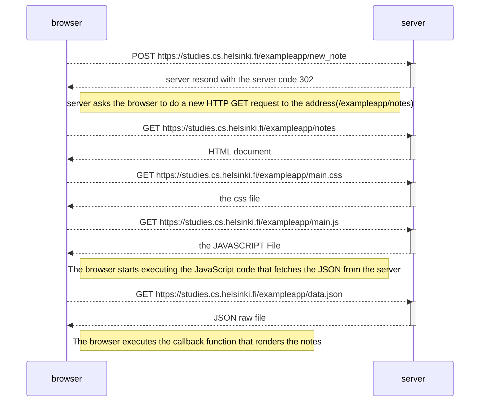

```mermaid
sequenceDiagram
participant browser
participant server

browser -->>server :POST https://studies.cs.helsinki.fi/exampleapp/new_note
activate server

server-->>browser : server resond with the server code 302
deactivate server
Note left of server: server asks the browser to do a new HTTP GET request to the address(/exampleapp/notes)


browser-->>server : GET https://studies.cs.helsinki.fi/exampleapp/notes
activate server
server-->>browser:HTML document
deactivate server

browser-->> server:GET https://studies.cs.helsinki.fi/exampleapp/main.css
activate server

server-->>browser : the css file
deactivate server

browser-->>server : GET https://studies.cs.helsinki.fi/exampleapp/main.js
activate server
server-->>browser : the JAVASCRIPT File
deactivate server

Note right of browser: The browser starts executing the JavaScript code that fetches the JSON from the server
 browser-->>server :GET https://studies.cs.helsinki.fi/exampleapp/data.json
 activate server
 server -->> browser:JSON raw file
deactivate server

Note right of browser: The browser executes the callback function that renders the notes
```