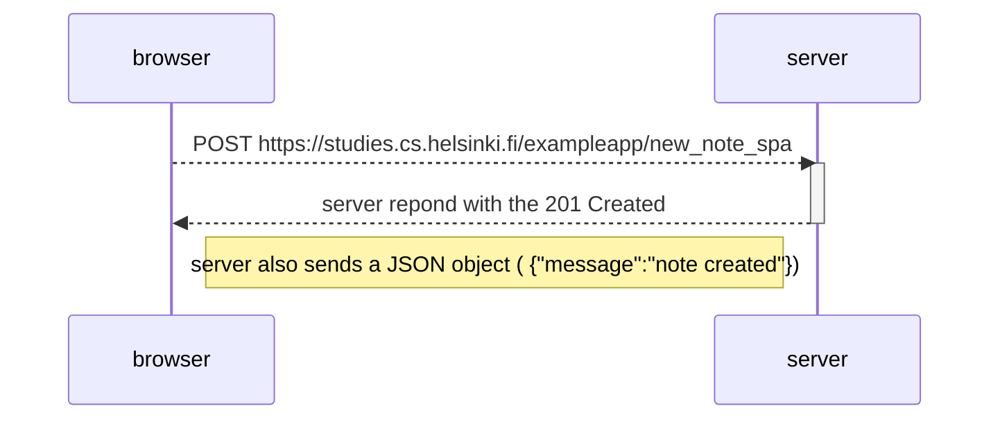

```mermaid
sequenceDiagram
participant browser
participant server

browser -->>server :POST https://studies.cs.helsinki.fi/exampleapp/new_note_spa
activate server

server-->>browser : server repond with the 201 Created
deactivate server
Note left of server: server also sends a JSON object ( {"message":"note created"})
```